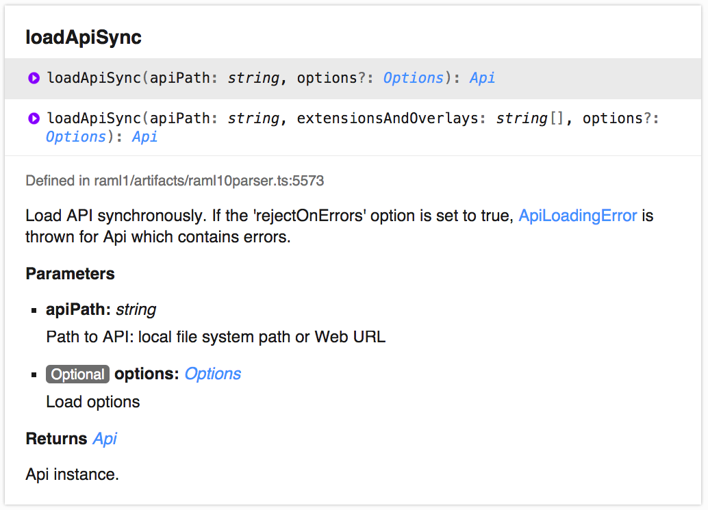
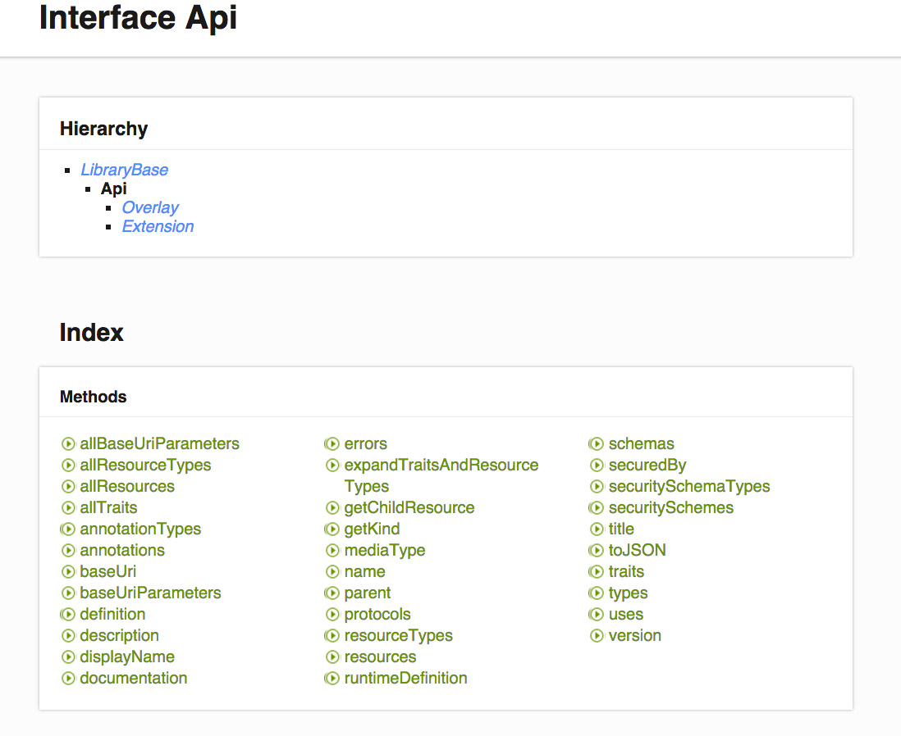
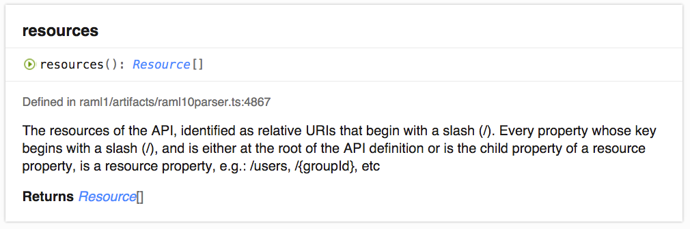
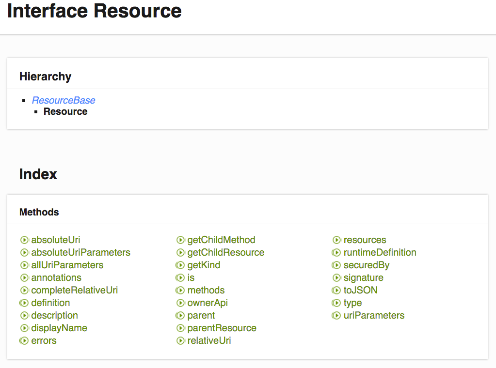

# Getting Started

## Intro

This document is intended to provide an initial knowledge of how to use RAML 1.0 JavaScript parser.

## Installation

###	Pre-required software

1.	[NodeJS](https://nodejs.org/en/download/)
2.	Install [git](https://git-scm.com/downloads)

###	RAML 1.0 JavaScript parser installation

NPM installation is recommended, but taking a quick look at the parser can be done via repository cloning.

#### Cloning Repository

Run the following command-line instructions:

```
git clone https://github.com/raml-org/raml-js-parser-2

cd raml-js-parser-2

npm install typescript // This line is temporary and required only to workaround a bug. To remove.

npm install
```

Quick tests:

```
node test/test.js  //here you should observe JSON representation of XKCD API in your console

node test/testAsync.js  //same as above but in asynchronous mode
```

If there are no any exceptions, RAML JS Parser is installed successfully

#### NPM installation

Run command line tool and create a folder where all you test files will be stored.

Create package.json file which should contain at least a dependency to raml-js-parser NodeJS module:
```json
{
  "name": "myParserTest",
    "dependencies":
    {
      "raml-1-parser": "https://github.com/raml-org/raml-js-parser-2"
    }
}
```

Run ```npm install ``` and wait while all the dependencies are downloaded
and properly initialized.

Run ```node node_modules/raml-1-parser/test/test01.js```. If there are no any exceptions, RAML JS Parser is installed successfully

## Creating test files

These instructions assume that JS Parser was installed via NPM.

Use your favorite text editor to create `getting_started.js` JS file in root of the module and add require instruction like that:

```js
// step1
var raml = require("raml-1-parser");
```

Create `test.raml` file in the same folder with the following contents:
```RAML
#%RAML 1.0
title: Pet shop
version: 1
baseUri: /shop

types:
  Pet:
    properties:
      name: string
      kind: string
      price: number
    example:
      name: "Snoopy"
      kind: "Mammal"
      price: 100

/pets:
  get:
    responses:
      200:
        body:
          application/json:
            type: Pet[]
  post:
    body:
      application/json:
        type: Pet
  /{id}:
    put:
      body:
        application/json:
          type: Pet
    delete:
      responses:
        204:

```

To do this, create your RAML 1.0 file using Atom editor with installed [apiworkbench plugin](http://apiworkbench.com/).

Edit your `getting_started.js` file to include RAML file loading:
```js
// step2
var fs = require("fs");
var path = require("path");

// Here we create a file name to be loaded
var fName = path.resolve(__dirname, "test.raml");

// Parse our RAML file with all the dependencies
var api = raml.loadApiSync(fName);
console.log(JSON.stringify(api.toJSON(), null, 2));

```

Run ```node getting_started.js``` again. If you see the JSON reflecting RAML file AST in the output, then RAML was parsed correctly.
`toJSON` method is a useful tool for debugging, but should not be relied upon by JS RAML Parser users to actually analyze and modify RAML AST.

## Basics of parsing

`api` variable stores the root of AST. Its children and properties can be traversed and analyzed to find out the structure of RAML file.

Open `documentation` folder in the root of the cloned repository and open index.html file in web browser.

`loadApiSync` function we just used to parse RAML is described there:



As it is a global function of parser module, we are calling it like that:
`raml.loadApiSync(fName)`, and is it returns `Api`.

Documentation displays, that `loadApiSync` returns `Api` object, so click it and see the details:



Lets check `resources()` method first:



We see that it returns an array of resources, and each resource contains some methods in turn:



Lets try checking resources and printing them in a simple way. Remove `console.log(JSON.stringify(api.toJSON(), null, 2));` line from `getting_started.js` code and add the following:

```js
var apiResources = api.resources();
apiResources.forEach(function (resource) {
    console.log(resource.getKind() + " : " + resource.absoluteUri());
});
```

The output is:
```
Resource : /shop/pets
```

Here, the `getKind()` method, which most of AST nodes have, will name what you have at hands, and `absoluteUri()` can be found in `Resource` documentation.

But why only `/shop/pets` is listed, and `/shop/pets/{id}` is not? Because AST is hierarchical, so `API` only has `/shop/pets` as a direct child, and `/shop/pets/{id}` is a child of `/shop/pets`.

Lets see if we can modify our code to print the whole resource tree:

```js
var raml = require("raml-1-parser");
var fs = require("fs");
var path = require("path");

// Here we create a file name to be loaded
var fName = path.resolve(__dirname, "test.raml");

// Parse our RAML file with all the dependencies
var api = raml.loadApiSync(fName);

/**
 * Process resource (here we just trace different paramters of URL)
 **/
function processResource(res) {
    // User-friendly name (if provided)
    if (res.displayName()) {
        console.log(res.displayName());
    }

    // Trace resource's relative URI
    var relativeUri = res.relativeUri().value();
    // Next method returns full relative URI (which is equal with previous one
    // for top-level resources, but for subresources it returns full path from the
    // resources base URL)
    var completeRelativeUri = res.completeRelativeUri();
    // trace both of them
    console.log(completeRelativeUri, "(", relativeUri, ")");

    // Let's enumerate all URI parameters
    for (var uriParamNum = 0; uriParamNum < res.allUriParameters().length; ++uriParamNum) {
        var uriParam = res.allUriParameters()[uriParamNum];
        // Here we trace URI parameter's name and types
        console.log("\tURI Parameter:", uriParam.name(), uriParam.type().join(","));
    }

    // Recursive call this function for all subresources
    for (var subResNum = 0; subResNum < res.resources().length; ++subResNum) {
        var subRes = res.resources()[subResNum];
        processResource(subRes);
    }
}

// Enumerate all the resources
for (var resNum = 0; resNum < api.resources().length; ++resNum) {
    processResource(api.resources()[resNum]);
}
```

The output is following:
```
/pets ( /pets )
/pets/{id} ( /{id} )
	URI Parameter: id string
```

Here, we use recursion to traverse resources, and for each resource print its `completeRelativeUri`, `relativeUri`, and `allUriParameters`. The description of each method can be found in documentation of `Resource` type.

Of course if we do not want to traverse the tree manually, we can find all kinds of useful helpers in documentation, like `allResources` method of `API`, which traverses the tree for you and finds all resources.

Lets print all the methods in that way, but first lets check `methods` documentation:


Replace everything under
```js
var api = raml.loadApiSync(fName);
```
line with the following:

```js
api.allResources().forEach(function (resource) {

    console.log(resource.absoluteUri())

    resource.methods().forEach(function(method){
        console.log("\t"+method.method())
    })
})
```

The output:
```
/shop/pets
	get
	post
/shop/pets/{id}
	put
	delete
```

`method` method of `Method` class prints HTTP type of the method.

We can also see the `responses` method in `Method` documentation:


Lets print the responses too:
```js
api.allResources().forEach(function (resource) {

    console.log(resource.absoluteUri())

    resource.methods().forEach(function(method){
        console.log("\t"+method.method())

        method.responses().forEach(function (response) {
            console.log("\t\t" + response.code().value())
        })
    })
})
```

The output is:
```
/shop/pets
	get
		200
	post
/shop/pets/{id}
	put
	delete
		204
```

To be able to print that, we first used `code()` method of `Response`:


And then found `value()` method in `StatusCodeString` description:


All in all, the AST tree reflects RAML structure, so starting from `loadApiSync` global method, then checking documentation for its return value, proceeding to its methods and doing that recursively allows reaching everything.

## Resource Types and Traits

This section describes how to analyze resource types. Traits are analyzed in the same way.

### Expanding AST

Lets change our RAML file to look like this:

```RAML
#%RAML 1.0
title: Pet shop
version: 1
baseUri: /shop

types:
  Pet:
    properties:
      name: string
      kind: string
      price: number
    example:
      name: "Snoopy"
      kind: "Mammal"
      price: 100

resourceTypes:

  Collection:
    get:
      responses:
        200:
          body:
            application/json:
              type: Pet[]
    post:
      body:
        application/json:
          type: Pet

  Member:
    put:
      body:
        application/json:
          type: Pet
    delete:
      responses:
        204:

/pets:
  type: Collection

  /{id}:
    type: Member

```

It differs from the previous sample by method declarations being moved to resource types, the real resources and methods structure remains the same.

Now change `getting_started.js` contents:
```js
var raml = require("raml-1-parser");
var fs = require("fs");
var path = require("path");

// Here we create a file name to be loaded
var fName = path.resolve(__dirname, "test.raml");

// Parse our RAML file with all the dependencies
var api = raml.loadApiSync(fName).expand();

api.allResources().forEach(function (resource) {

    console.log(resource.absoluteUri())

    resource.methods().forEach(function(method){
        console.log("\t"+method.method())

        method.responses().forEach(function (response) {
            console.log("\t\t" + response.code().value())
        })
    })
})

```

And launch it.

Results are:

```
/shop/pets
	get
		200
	post
/shop/pets/{id}
	put
	delete
		204
```

So when RAML JS Parser is asked to expand traits and types, you get them applied automatically and have the final structure at hands.

If you change the API loading call to
```js
var api = raml.loadApiSync(fName);
```
the output will look like:

```
/shop/pets
/shop/pets/{id}
```

So without resource type expansion the methods and other contents from resource types are not added to the point of the AST, they are applied to.

### Getting the name of resource type from its application

We can see the resource type applications itself:

```js
var resourceTypeValue = api.allResources()[0].type().value().valueName()
console.log(resourceTypeValue)
```

Here we take the `/pets` resource, getting its type and printing the value of the type.

The output is:
```
Collection
```

### Getting resource type application parameter values

This can be done with both expanded and unexpanded AST.

Why did we have to call `valueName()` method after calling `value()`, why not just make `value()` to return the type name?

The answer is: the resource type appliance may also have parameters.

Right now it is hard to obtain the parameters at the top level of AST, but going one level down to high-level AST allows that. This should be exposed at top level AST in the nearest future. The current code below will continue to work, but there will be more suitable helpers available at the top level regarding this matter.

TODO: rewrite this part when structured values are wrapped at top level of AST.

Change the RAML file like following:

```RAML
#%RAML 1.0
title: Pet shop
version: 1
baseUri: /shop

types:
  Pet:
    properties:
      name: string
      kind: string
      price: number
    example:
      name: "Snoopy"
      kind: "Mammal"
      price: 100

resourceTypes:

  Collection:
    get:
      responses:
        200:
          body:
            application/json:
              type: <<item>>[]
    post:
      body:
        application/json:
          type: <<item>>

  Member:
    put:
      body:
        application/json:
          type: <<item>>
    delete:
      responses:
        204:

/pets:
  type: { Collection: {item: Pet} }

  /{id}:
    type: { Member: {item : Pet} }

```

In this example we made both resource types to have a type parameter.
In case of `/pets` resource, which refers `Collection` resource type, the `item` parameter value is `Pet`.

Change `getting_started.js` like following:
```js
var raml = require("raml-1-parser");
var fs = require("fs");
var path = require("path");

// Here we create a file name to be loaded
var fName = path.resolve(__dirname, "test.raml");

// Parse our RAML file with all the dependencies
var api = raml.loadApiSync(fName);

var resourceTypeReference = api.allResources()[0].type().value()
var highLevelASTNode = resourceTypeReference.toHighlevel()

highLevelASTNode.attrs().forEach(function (attribute) {
    console.log(attribute.name() + " = " + attribute.value())
})
```

Here we call `toHighlevel()` method, which is available for every top-level AST node and get the high-level node, then print its attributes. High-level nodes do not have have its data wrapped to user-friendly helper methods, instead they have attributes and children.

The output is the following:
```
key = Collection
item = Pet
```

So the `item` parameter value `Pet` is available.

As soon as navigation module is published, it will be possible to directly jump from this resource type appliance to `Collection` resource type declaration as we do in API Workbench.

For now, lets see how resource type declarations can be access directly from API:

### Getting resource type declarations

Modify `getting_started.js` file contents in the following way:

```js
var raml = require("raml-1-parser");
var fs = require("fs");
var path = require("path");

// Here we create a file name to be loaded
var fName = path.resolve(__dirname, "test.raml");

// Parse our RAML file with all the dependencies
var api = raml.loadApiSync(fName);


api.resourceTypes().forEach(function (resourceType) {
    console.log(resourceType.name())
})
```

Here we ask API for resource type declarations and print type names.

The output:
```
Collection
Member
```

And now we will print methods and responses for each resource type the same way we did previously for API:
```js
api.resourceTypes().forEach(function (resourceType) {
    console.log(resourceType.name())

    resourceType.methods().forEach(function(method){
        console.log("\t"+method.method())

        method.responses().forEach(function (response) {
            console.log("\t\t" + response.code().value())
        })
    })
})
```

The output:

```
Collection
	get
		200
	post
Member
	put
	delete
		204
```

## Types

Note: here elements renaming are most possible during the next week.
TODO: change names as soon as the elements are renamed.

Lets print all types declared at top level of API.

`API` has `types()` method, returning an array of TypeDeclaration:


`TypeDeclaration` is the root of the hierarchy for AST type declarations:


In the hierarchy, `ObjectTypeDeclaration` is basically RAML object type, StringTypeDeclaration is a string, NumberTypeDeclaration is a number, UnionTypeDeclaration represents a union type etc.
Note that this is a hierarchy of type DECLARATIONS. Types also have runtime representation with its own hierarchy.

We can see that `TypeDeclaration` has `name()` method, so we can print type names:

```js
api.types().forEach(function (type) {
	console.log(type.name());
});
```
Output is:

```
Pet
Mammal
Bird
```

`Pet`, `Mammal` and `Bird` are object types, lets check that:

```js
api.types().forEach(function (type) {
    console.log(type.name() + " : " + type.getKind());

});
```

Output:

```
Pet : ObjectTypeDeclaration
Mammal : ObjectTypeDeclaration
Bird : ObjectTypeDeclaration
```

Checking `ObjectTypeDeclaration` in documentation reveals it having `properties` method, in turn returning an array of `TypeDeclaration`


So we can print property names and their own types for each type:

```js
api.types().forEach(function (type) {

    console.log(type.name() + " : " + type.getKind());

    type.properties().forEach(function(prop) {
        console.log("\t", prop.name() + " : " + prop.getKind());
    });

});
```

Output:

```
Pet : ObjectTypeDeclaration
	 name : StringTypeDeclaration
	 kind : StringTypeDeclaration
	 price : NumberTypeDeclaration
	 color : StringTypeDeclaration
Mammal : ObjectTypeDeclaration
Bird : ObjectTypeDeclaration
	 wingLength : NumberTypeDeclaration
```

`Color` is also an enum. We can detect and print that:

```js
api.types().forEach(function (type) {

    console.log(type.name() + " : " + type.getKind());

    type.properties().forEach(function(prop) {
        console.log("\t", prop.name() + " : " + prop.getKind());
        if (prop.enum()) {
            prop.enum().forEach(function(enumValue){
                console.log("\t\t-", enumValue);
            })
        }
    });

});
```

Output:

```
Pet : ObjectTypeDeclaration
	 name : StringTypeDeclaration
	 kind : StringTypeDeclaration
	 price : NumberTypeDeclaration
	 color : StringTypeDeclaration
		- White
		- Black
		- Colored
Mammal : ObjectTypeDeclaration
Bird : ObjectTypeDeclaration
	 wingLength : NumberTypeDeclaration
```

Mammal and Bird are of Pet type. Lets print that too:

```js
api.types().forEach(function (type) {

    console.log(type.name() + " : " + type.getKind());
    if (type.type() && type.type().length > 0)
        console.log("\t type: " + type.type())

    type.properties().forEach(function(prop) {
        console.log("\t", prop.name() + " : " + prop.getKind());
    });

});
```

Output:

```
Pet : ObjectTypeDeclaration
	 name : StringTypeDeclaration
	 kind : StringTypeDeclaration
	 price : NumberTypeDeclaration
	 color : StringTypeDeclaration
Mammal : ObjectTypeDeclaration
	 type: Pet
Bird : ObjectTypeDeclaration
	 type: Pet
	 wingLength : NumberTypeDeclaration
```

TODO: describe runtime representation of types.
